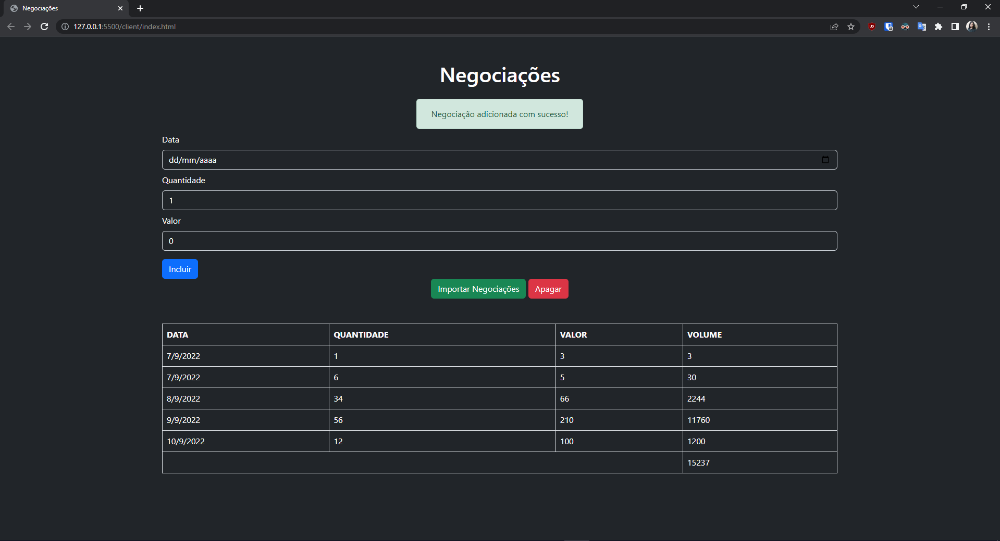

# Curso de JavaScript: conhecendo o Browser e padrões de projeto

 

## O que aprendi no curso:

<ul>
  <li> Una o paradigma orientado a objetos ao funcional para resolver problemas
  <li> Aplique novos recursos do ECMASCRIPT 6
  <li> Estruture sua aplicação no modelo MVC
  <li> Utilize padrões de projeto
</ul>

 

## Preview do projeto

 

